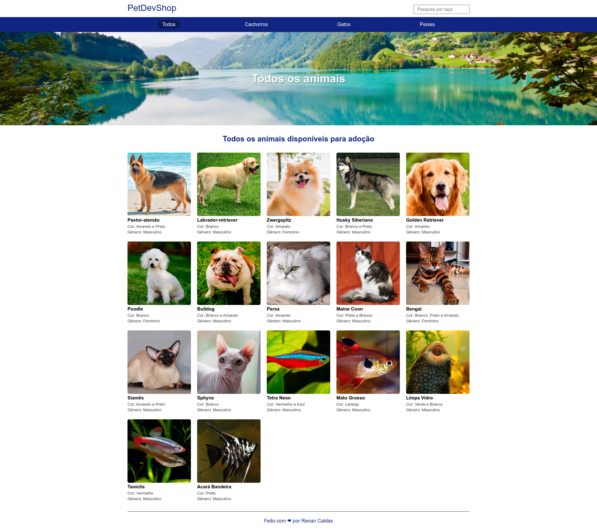

<h1 align="center"> Projeto canil </h1>

  

## 💻 Projeto

Projeto feito em node e ts que separa cada animal por especie ou pode visualizar todos em conjunto, também é possível procurar por nome.

## 🚀 Tecnologias

- node.js
- Typescript
- Express
- mustache

### Instalação

`npm install`

### Para rodar o projeto

`npm run start`
